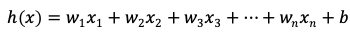
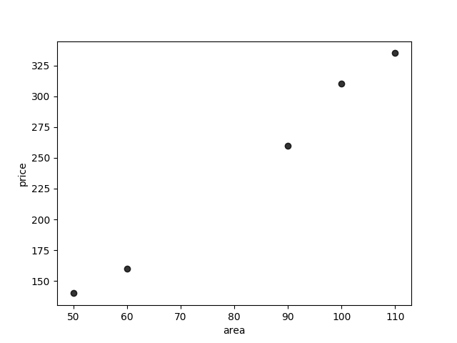

通常我们学习机器学习都是从线性回归模型开始的。线性回归模型形式简单、易于建模，但是我们可以从中学习到机器学习的一些重要的基本思想。

> **回归**  是由达尔文的表兄弟弗朗西斯·高尔顿发明的。高尔顿于1877年完成了第一次回归预测，目的是根据上一代豌豆种子(双亲)的尺寸来预测下一代豌豆种子(孩子)的尺寸。高尔顿在大量对象上应用了回归分析，甚至包括人的身高。他注意到，如果双亲的高度比平均高度高，他们的子女也倾向于比平均高度高，但尚不及双亲。孩子的高度向着平均高度回退(回归)。高尔顿在多项研究上都注意到这个现象，所以尽管这个英文单词跟数值预测没有任何关系，但这种研究方法仍被称作回归。

线性回归的模型形如：

线性回归得出的模型不一定是一条直线，在只有一个变量的时候，模型是平面中的一条直线；有两个变量的时候，模型是空间中的一个平面；有更多变量时，模型将是更高维的。 

线性回归模型有很好的可解释性，可以从权重W直接看出每个特征对结果的影响程度。

线性回归适用于X和y之间存在线性关系的数据集，可以使用计算机辅助画出散点图来观察是否存在线性关系)。例如我们假设房屋价格和房屋面积之间存在某种线性关系，画出散点图如下图所示。

看起来这些点分布在一条直线附近，我们尝试使用一条直线来拟合数据，使所有点到直线的距离之和最小。线性回归中使用**均方误差**作为代价函数(cost function)。使所有点到直线的距离之和最小，就是使均方误差最小化，这个方法叫做**最小二乘法**。

代价函数：

其中，

下面求使J最小的W和b：

1.偏导数法

偏导数法是非常麻烦的，需要一个一个地计算w。为了方便，这里以单变量线性回归为例。

2.正规方程法

正规方程使用矩阵运算，可以一次求出W向量。

3.这里的代价函数J的海森矩阵H是半正定的，因此J一定有全局最小值，所以也可以使用梯度下降法来求解。梯度下降法是一种迭代解法，不仅可以求最小二乘问题，也适用于其它代价函数的问题。但是需要设置学习率α，如果α设置的不好，训练会花费很长时间，而且梯度下降法需要对数据集进行特征缩放。一般会在数据集特别大的时候或者xTx不可逆的时候使用梯度下降法，后面再做介绍。

4.还有一些其他的方法就不一一列举了，比如，查看sklearn的源码会发现它使用的奇异值分解。

计算出的模型如下图。

