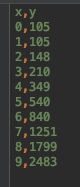
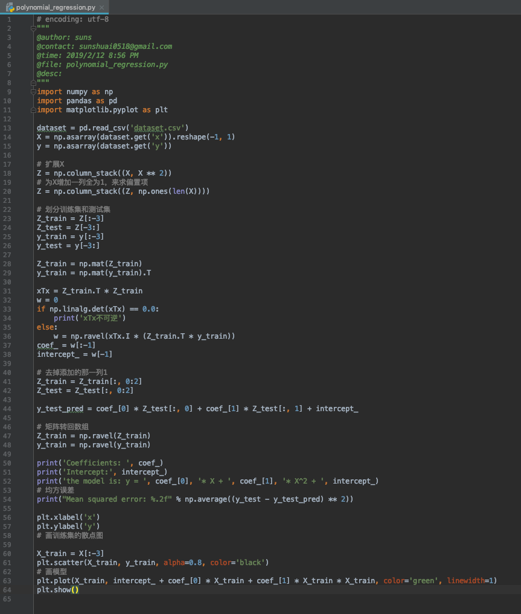
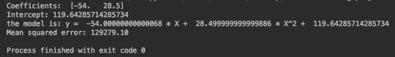
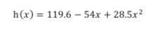

使用python实现多项式回归，没有使用sklearn等机器学习框架，目的是帮助理解算法的原理。

使用一个简单的数据集来模拟，只有几条数据。

#### 代码

1. 从数据集中读取X和y。
2. 为X添加二次方项，用Z替换。
3. 给Z添加 1 列，初始化为 1 ，用来求偏置项。
4. 划分训练集和测试集。
5. 将Z和y的训练集转换为矩阵形式。
6. 和线性回归类似，使用正规方程法，先验证矩阵的可逆性。
7. 去掉Z中全为1的列。
8. 使用测试集验证模型。
9. Z和y的训练集转换回数组形式。
10. 打印结果和图片。

#### 运行结果

从图中看出数据分布在一条抛物线附近。

最终得到的模型为：

如果需要代码和数据集，请扫描下面二维码关注公众号【AI developer】，回复【代码】即可免费获取。

