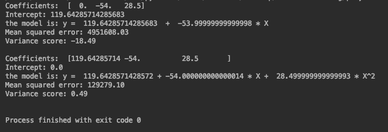

使用sklearn框架实现线性回归。使用框架更方便，可以少写很多代码。

使用一个简单的数据集来模拟，只有几条数据。

#### 代码

如果不用框架，需要自己手动对数据添加高阶项，有了框架就方便多了。sklearn 使用 Pipeline 函数简化这部分预处理过程。

当 PolynomialFeatures 中的degree=1时，效果和使用 LinearRegression 相同，得到的是一个线性模型，degree=2时，是二次方程，如果是单变量的就是抛物线，双变量的就是抛物面。以此类推。

这里有一个 fit_intercept 参数，下面通过一个例子看一下它的作用。

当 fit_intercept 为 True 时，coef_ 中的第一个值为 0，intercept_ 中的值为实际的截距。

当 fit_intercept 为 False 时，coef_ 中的第一个值为截距，intercept_ 中的值为 0。

如图，第一部分是 fit_intercept 为 True 时的结果，第二部分是 fit_intercept 为 False 时的结果。

也就是说当 fit_intercept 为 False 时，模型就把截距放到系数的list里面了，不单独拿出来。

为了方便，本文中我们都把 fit_intercept 设成 False。

#### 运行结果

从图中看出数据分布在一条抛物线附近。

最终得到的模型为：

如果需要代码和数据集，请扫描下面二维码关注公众号【AI developer】，回复【代码】即可免费获取。

