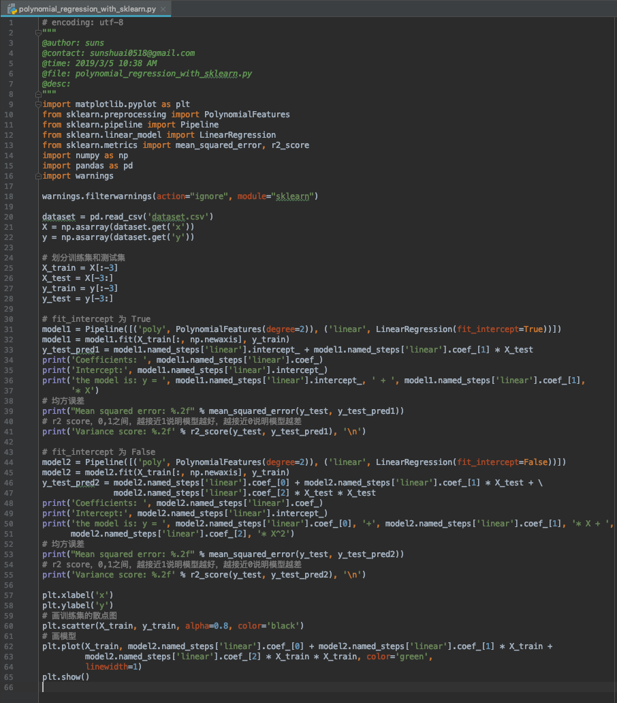

。。。。。。

sklearn 使用 Pipeline 函数简化这部分预处理过程。

当 PolynomialFeatures 中的degree=1时，效果和使用 LinearRegression 相同，得到的是一个线性模型。这里有一个 fit_intercept 参数，下面通过一个例子看一下它的作用。

当 fit_intercept 为 True 时，coef_ 中的第一个值为 0，intercept_ 中的值为实际的截距。

当 fit_intercept 为 False 时，coef_ 中的第一个值为截距，intercept_ 中的值为 0。

也就是说当 fit_intercept 为 False 时，模型就把截距放到系数的list里面了，不单独拿出来。

为了方便，本文中我们都把 fit_intercept 设成 False。

#### 代码

#### 运行结果

