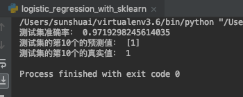

代码：

```python
# encoding: utf-8
"""
@author: suns
@contact: sunshuai0518@gmail.com
@time: 2019/7/2 8:26 AM
@file: logistic_regression.py
@desc:
"""
import numpy as np
import pandas as pd
import matplotlib.pyplot as plt
from sklearn.model_selection import train_test_split

dataset = pd.read_csv('dataset.csv', delimiter=',')

X = np.asarray(dataset.get(['x1', 'x2']))
X = np.column_stack((np.ones(len(X)), X))

y = np.asarray(dataset.get('y'))

X_train, X_test, y_train, y_test = train_test_split(X, y, test_size=0.5)

# array转换为matrix
X_matrix = np.mat(X_train)
y_matrix = np.mat(y_train).transpose()

m, n = np.shape(X_matrix)
alpha = 0.001
maxCycles = 800
weights = np.ones((n, 1))
for k in range(maxCycles):
    h = 1.0 / (1 + np.exp(-(X_matrix * weights)))
    cost = (y_matrix - h)
    weights = weights + alpha * X_matrix.transpose() * cost

# matrix转换为array
weights = weights.getA()


def predict(x0, x1, x2):
    if (1.0 / (1 + np.exp(-(weights[0] * x0 + weights[1] * x1 + weights[2] * x2)))) >= 0.5:
        return 1
    else:
        return 0

num_true = 0.0

# 预测测试集
for i in range(len(y_test)):
    if predict(X_test[i][0], X_test[i][1], X_test[i][2]) == y_test[i]:
        num_true += 1

# 打印准确率
print('测试集准确率：', num_true / len(y_test))


n = np.shape(X_train)[0]
xcord1 = []
ycord1 = []
xcord2 = []
ycord2 = []
for i in range(n):
    if int(y_train[i]) == 1:
        xcord1.append(X_train[i, 1])
        ycord1.append(X_train[i, 2])
    else:
        xcord2.append(X_train[i, 1])
        ycord2.append(X_train[i, 2])
fig = plt.figure()
ax = fig.add_subplot(111)
ax.scatter(xcord1, ycord1, s=30, c='red', marker='s')
ax.scatter(xcord2, ycord2, s=30, c='green')
x_ = np.arange(-3.0, 3.0, 0.1)
y_ = (-weights[0] - weights[1] * x_) / weights[2]
ax.plot(x_, y_)
plt.xlabel('x1')
plt.ylabel('x2')
plt.show()
```


运行结果：





<div align=center>
<div style="align: center" >

</div>
